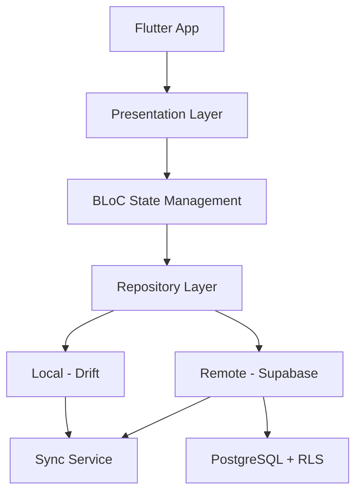

# EdSentre - نظام إدارة المراكز التعليمية
# Educational Center Management System

<div align="center">


**نظام شامل لإدارة المراكز التعليمية مع دعم Offline-first و Multi-tenancy**

[الوثائق](./docs/) | [البداية السريعة](./docs/GETTING_STARTED.md) | [التحليل الكامل](./docs/project_analysis_and_plan.md)

</div>

---

## 📋 نظرة عامة (Overview)

**EdSentre** هو نظام متكامل لإدارة المراكز التعليمية يدعم:
- 🏢 تعدد المراكز والفروع (Multi-tenancy)
- 📱 العمل بدون اتصال (Offline-first)
- 🔐 أمان متقدم مع RLS
- 👥 أدوار وصلاحيات متعددة
- 🔄 مزامنة ثنائية الاتجاه
- 📊 تقارير وتحليلات شاملة

---

## ✨ الميزات الرئيسية (Key Features)

### إدارة الطلاب 👨‍🎓
- ✅ إضافة/تعديل/حذف الطلاب
- ✅ ربط الطلاب بالمواد
- ✅ متابعة الحضور والغياب
- ✅ إدارة الدرجات
- ✅ ملفات الطلاب الشاملة

### إدارة المعلمين 👨‍🏫
- ✅ إدارة بيانات المعلمين
- ✅ ربط المعلمين بالمواد
- ✅ إدارة الرواتب
- ✅ جداول المعلمين

### الحضور والغياب 📊
- ✅ تسجيل الحضور السريع
- ✅ تقارير الحضور
- ✅ إشعارات الغياب
- ✅ إحصائيات الحضور

### المدفوعات 💰
- ✅ إدارة المدفوعات
- ✅ الفواتير
- ✅ المتأخرات
- ✅ تقارير مالية

### الجداول الدراسية 📅
- ✅ إنشاء الجداول
- ✅ إدارة القاعات
- ✅ تجنب التعارضات
- ✅ عرض الجداول

---

## 🏗️ البنية المعمارية (Architecture)



### الطبقات (Layers)
1. **Presentation**: UI Components + Screens
2. **BLoC**: State Management
3. **Domain**: Models + Use Cases
4. **Data**: Repositories + Data Sources
5. **Core**: Utilities + Services

---

## 🚀 البداية السريعة (Quick Start)

> ⚠️ **مهم**: إذا واجهت مشكلة "infinite recursion in RLS" عند التسجيل، اقرأ [دليل إصلاح مشكلة التسجيل](./docs/FIX_SIGNUP_ISSUE.md)

### المتطلبات
- Flutter 3.24.0 أو أحدث
- Dart 3.8.0 أو أحدث
- حساب Supabase

### التثبيت

```bash
# 1. نسخ المستودع
git clone <repository-url>
cd ed_sentre

# 2. تثبيت الحزم
flutter pub get

# 3. إعداد Supabase
cp supabase.env.example supabase.env
# املأ البيانات في supabase.env

# 4. توليد كود Drift
flutter packages pub run build_runner build --delete-conflicting-outputs

# 5. تشغيل التطبيق
flutter run --dart-define-from-file=supabase.env
```

📖 **للتفاصيل الكاملة**: اقرأ [دليل البداية السريعة](./docs/GETTING_STARTED.md)

> 🔧 **حل المشاكل**: إذا واجهت أي مشاكل، راجع [دليل حل المشاكل](./docs/TROUBLESHOOTING.md)

---

## 📁 هيكل المشروع (Project Structure)

```
ed_sentre/
├── lib/
│   ├── core/                    # الوحدات الأساسية
│   │   ├── auth/               # المصادقة والصلاحيات
│   │   ├── database/           # Drift Database
│   │   ├── sync/               # خدمة المزامنة
│   │   ├── error/              # معالجة الأخطاء
│   │   ├── supabase/           # Supabase Client
│   │   ├── routing/            # GoRouter
│   │   └── theme/              # Themes
│   ├── features/               # الميزات
│   │   ├── auth/              # تسجيل الدخول
│   │   ├── dashboard/         # لوحة التحكم
│   │   ├── students/          # إدارة الطلاب
│   │   ├── teachers/          # إدارة المعلمين
│   │   ├── attendance/        # الحضور
│   │   ├── payments/          # المدفوعات
│   │   └── ...
│   ├── shared/                # المشترك
│   │   ├── models/           # النماذج
│   │   ├── widgets/          # Widgets
│   │   └── data/             # Repositories
│   └── main.dart
├── docs/                       # التوثيق
│   ├── project_analysis_and_plan.md
│   ├── GETTING_STARTED.md
│   ├── FIX_SIGNUP_ISSUE.md      # 🔧 إصلاح مشكلة التسجيل
│   ├── TROUBLESHOOTING.md
│   ├── WEEK_1_IMPLEMENTATION.md
│   ├── fix_rls_infinite_recursion.sql
│   ├── rls_policies.sql
│   └── ...
└── test/                       # الاختبارات
```

---

## 🔐 الأمان (Security)

### Row Level Security (RLS)
- ✅ تفعيل RLS على جميع الجداول
- ✅ عزل البيانات بين المراكز
- ✅ صلاحيات حسب الدور

### الأدوار المدعومة
```dart
- Super Admin    // صلاحيات كاملة
- Center Admin   // إدارة مركز واحد
- Accountant     // المدفوعات فقط
- Coordinator    // الجداول والحضور
- Teacher        // التدريس والدرجات
- Student        // عرض فقط
- Parent         // متابعة الأبناء
```

📖 **للتفاصيل**: [`docs/rls_policies.sql`](./docs/rls_policies.sql)

---

## 📊 الحالة الحالية (Current Status)

### ✅ مكتمل
- [x] البنية الأساسية (Flutter + Supabase + Drift)
- [x] نماذج البيانات
- [x] Repository Pattern
- [x] BLoC State Management
- [x] الواجهات الأساسية
- [x] RoleProvider
- [x] ErrorHandler
- [x] SyncService (أساسي)

### 🚧 قيد التطوير
- [ ] تطبيق RLS في Supabase (⚠️ **مطلوب الآن**: [`fix_rls_infinite_recursion.sql`](./docs/FIX_SIGNUP_ISSUE.md))
- [ ] Permission Checks في الواجهات
- [ ] SyncService كامل
- [ ] الاختبارات
- [ ] CI/CD

### 📅 المخطط
- Week 1-3: RLS + Security
- Week 4-6: Sync + Quality
- Week 7-10: Advanced Features
- Week 11-14: Mobile + Testing
- Week 15-20: Separate Apps

📖 **للخطة الكاملة**: [`docs/project_analysis_and_plan.md`](./docs/project_analysis_and_plan.md)

---

## 🧪 الاختبارات (Testing)

```bash
# تشغيل جميع الاختبارات
flutter test

# مع التغطية
flutter test --coverage

# اختبارات محددة
flutter test test/models_test.dart
```

---

## 📚 التوثيق (Documentation)

### المستندات الرئيسية
- 📖 [دليل البداية السريعة](./docs/GETTING_STARTED.md)
- 📊 [التحليل الكامل والخطة](./docs/project_analysis_and_plan.md)
- ⏱️ [خطة الأسبوع الأول](./docs/WEEK_1_IMPLEMENTATION.md)
- 📝 [ملخص التنفيذ](./docs/IMPLEMENTATION_SUMMARY.md)
- 🔐 [سياسات RLS](./docs/rls_policies.sql)
- 🏗️ [البنية المعمارية](./docs/architecture.md)
- 🔄 [تصميم المزامنة](./docs/sync_design.md)

---

## 🤝 المساهمة (Contributing)

 نرحب بالمساهمات! يرجى:

1. Fork المشروع
2. إنشاء فرع للميزة (`git checkout -b feature/AmazingFeature`)
3. Commit التغييرات (`git commit -m 'Add some AmazingFeature'`)
4. Push للفرع (`git push origin feature/AmazingFeature`)
5. فتح Pull Request

### معايير الكود
- اتبع [Effective Dart](https://dart.dev/guides/language/effective-dart)
- استخدم `flutter analyze` قبل الـ commit
- اكتب اختبارات للميزات الجديدة
- وثق الكود المعقد

---

## 📄 الترخيص (License)

This project is licensed under the MIT License - see the LICENSE file for details.

---

## 📞 الدعم (Support)

### روابط مفيدة
- [Flutter Documentation](https://flutter.dev/docs)
- [Supabase Documentation](https://supabase.com/docs)
- [Drift Documentation](https://drift.simonbinder.eu/)
- [BLoC Documentation](https://bloclibrary.dev/)

### الإبلاغ عن مشاكل
إذا وجدت مشكلة، يرجى فتح [Issue](../../issues) مع:
- وصف واضح للمشكلة
- خطوات إعادة الإنتاج
- لقطات الشاشة (إن أمكن)
- سجلات الأخطاء

---

<div align="center">

**تم بناؤه بـ ❤️ باستخدام Flutter و Supabase**

⭐ إذا أعجبك المشروع، لا تنسَ إعطاءه نجمة!

</div>

## Getting Started

This project is a starting point for a Flutter application.

A few resources to get you started if this is your first Flutter project:

- [Lab: Write your first Flutter app](https://docs.flutter.dev/get-started/codelab)
- [Cookbook: Useful Flutter samples](https://docs.flutter.dev/cookbook)

For help getting started with Flutter development, view the
[online documentation](https://docs.flutter.dev/), which offers tutorials,
samples, guidance on mobile development, and a full API reference.

## Supabase configuration

Provide Supabase credentials via `--dart-define` or a file:

```
flutter run --dart-define-from-file=supabase.env
```

Use `supabase.env.example` as a template and **do not commit real keys**.


EdSentre - نظام إدارة المراكز التعليمية
توثيق شامل للنظام مع التركيز على جزء الطالب
📋 نظرة عامة على النظام
EdSentre هو نظام متكامل لإدارة المراكز التعليمية (السناتر) يوفر إدارة شاملة لجميع جوانب المركز التعليمي.

الأطراف المستفيدة:
إدارة السنتر - تطبيق Desktop (Flutter Windows)
الطلاب - تطبيق Mobile (سيتم تطويره)
المعلمين - ميزات في تطبيق الإدارة
التقنيات المستخدمة:
Frontend: Flutter (Desktop & Mobile)
Backend: Supabase (PostgreSQL + Auth + Storage + Realtime)
State Management: Flutter Bloc
معمارية: Clean Architecture with Repository Pattern
Offline Support: نظام تخزين مؤقت ذكي
🏗️ معمارية النظام
هيكلة المشروع:
ed_sentre/
├── lib/
│   ├── core/                    # الوظائف الأساسية
│   │   ├── auth/               # المصادقة والتحقق
│   │   ├── supabase/           # تكامل Supabase
│   │   ├── offline/            # نظام التخزين المؤقت
│   │   ├── sync/               # مزامنة البيانات
│   │   └── l10n/               # الترجمة والنصوص
│   │
│   ├── shared/                  # الموارد المشتركة
│   │   ├── models/             # نماذج البيانات
│   │   ├── data/               # Repository والـ Data Layer
│   │   └── widgets/            # مكونات UI مشتركة
│   │
│   └── features/                # الميزات الرئيسية
│       ├── students/           # إدارة الطلاب
│       ├── teachers/           # إدارة المعلمين
│       ├── subjects/           # إدارة المواد
│       ├── schedule/           # الجدول الدراسي
│       ├── attendance/         # نظام الحضور
│       ├── payments/           # المدفوعات
│       └── reports/            # التقارير
طبقات النظام (Layers):
┌─────────────────────────────┐
│   Presentation Layer        │ ← UI + Bloc
├─────────────────────────────┤
│   Domain Layer              │ ← Models + Business Logic
├─────────────────────────────┤
│   Data Layer                │ ← Repository + Mappers
├─────────────────────────────┤
│   External Services         │ ← Supabase + Cache
└─────────────────────────────┘
👨‍🎓 نموذج بيانات الطالب (Student Model)
الحقول الأساسية:
class Student {
  final String id;                    // UUID من Supabase
  final String name;                  // اسم الطالب
  final String phone;                 // رقم الهاتف
  final String? studentNumber;        // رقم الطالب (اختياري)
  final String? email;                // البريد الإلكتروني
  final String? imageUrl;             // صورة الطالب
  final DateTime birthDate;           // تاريخ الميلاد
  final String address;               // العنوان
  final String stage;                 // المرحلة الدراسية
  final List<String> subjectIds;      // IDs المواد المسجل فيها
  final String? parentId;             // ID ولي الأمر
  final StudentStatus status;         // حالة الطالب
  final DateTime createdAt;           // تاريخ التسجيل
  final DateTime? lastAttendance;     // آخر حضور
  final String? gradeLevel;           // الصف الدراسي
}
حالات الطالب (StudentStatus):
enum StudentStatus {
  active,      // نشط - يحضر بانتظام
  suspended,   // موقوف - تم إيقافه مؤقتًا
  overdue,     // متأخر في الدفع
  inactive     // غير نشط - توقف عن الحضور
}
قاعدة البيانات (Supabase Table):
جدول students:

CREATE TABLE students (
  id UUID PRIMARY KEY DEFAULT gen_random_uuid(),
  user_id UUID REFERENCES auth.users(id),  -- ربط مع حساب المستخدم
  center_id UUID NOT NULL,                  -- ID المركز التعليمي
  name TEXT NOT NULL,
  phone TEXT NOT NULL,
  student_number TEXT UNIQUE,
  email TEXT,
  image_url TEXT,
  birth_date DATE NOT NULL,
  address TEXT NOT NULL,
  stage TEXT NOT NULL,
  parent_id UUID,
  status TEXT DEFAULT 'active',
  created_at TIMESTAMP DEFAULT NOW(),
  last_attendance TIMESTAMP,
  grade_level TEXT,
  
  CONSTRAINT valid_status CHECK (status IN ('active', 'suspended', 'overdue', 'inactive'))
);
جدول student_courses (علاقة الطالب بالمواد):

CREATE TABLE student_courses (
  id UUID PRIMARY KEY DEFAULT gen_random_uuid(),
  student_id UUID REFERENCES students(id) ON DELETE CASCADE,
  course_id UUID REFERENCES courses(id) ON DELETE CASCADE,
  enrolled_at TIMESTAMP DEFAULT NOW(),
  
  UNIQUE(student_id, course_id)
);
📚 المواد والدورات (Subjects/Courses)
نموذج بيانات المادة:
class Subject {
  final String id;
  final String name;                  // اسم المادة
  final String? description;          // وصف المادة
  final double monthlyFee;            // الرسوم الشهرية
  final List<String> teacherIds;      // IDs المعلمين
  final bool isActive;                // نشطة أم لا
  final int studentCount;             // عدد الطلاب المسجلين
  final String? gradeLevel;           // المرحلة الدراسية
}
الربط بين الطالب والمواد:
الطالب يمكنه التسجيل في عدة مواد في نفس الوقت. التسجيل في المادة يعني:

دفع رسوم شهرية محددة لكل مادة
حضور الحصص حسب الجدول الدراسي
تسجيل الحضور/الغياب لكل حصة
📅 الجدول الدراسي (Schedule)
نموذج بيانات الحصة:
class ScheduleSession {
  final String id;
  final String subjectId;             // ID المادة
  final String subjectName;           // اسم المادة
  final String teacherId;             // ID المعلم
  final String teacherName;           // اسم المعلم
  final String roomId;                // ID القاعة
  final String roomName;              // اسم القاعة
  final DayOfWeek dayOfWeek;          // يوم الأسبوع
  final String startTime;             // وقت البداية (HH:MM)
  final String endTime;               // وقت النهاية (HH:MM)
  final SessionStatus status;         // حالة الحصة
  final String gradeLevel;            // الصف المستهدف
}
حالات الحصة:
enum SessionStatus {
  scheduled,   // مجدولة
  cancelled,   // ملغاة
  completed,   // منتهية
  ongoing      // جارية الآن
}
أيام الأسبوع:
enum DayOfWeek {
  saturday,    // السبت
  sunday,      // الأحد
  monday,      // الاثنين
  tuesday,     // الثلاثاء
  wednesday,   // الأربعاء
  thursday,    // الخميس
  friday       // الجمعة
}
كيفية عرض الجدول للطالب:
// 1. جلب جميع مواد الطالب
List<String> studentSubjectIds = student.subjectIds;
// 2. جلب حصص هذه المواد
List<ScheduleSession> studentSessions = allSessions.where(
  (session) => studentSubjectIds.contains(session.subjectId)
).toList();
// 3. تنظيمها حسب اليوم والوقت
Map<DayOfWeek, List<ScheduleSession>> weeklySchedule = 
  groupSessionsByDay(studentSessions);
✅ نظام الحضور (Attendance)
نموذج بيانات الحضور:
class AttendanceRecord {
  final String id;
  final String studentId;             // ID الطالب
  final String sessionId;             // ID الحصة
  final String subjectId;             // ID المادة
  final DateTime date;                // تاريخ الحضور
  final AttendanceStatus status;      // حالة الحضور
  final DateTime? checkInTime;        // وقت الدخول الفعلي
  final String? notes;                // ملاحظات
}
حالات الحضور:
enum AttendanceStatus {
  present,     // حاضر
  absent,      // غائب
  late,        // متأخر
  excused      // غياب بعذر
}
نظام الحضور الذكي (Smart Attendance):
النظام يدعم تسجيل حضور ذكي:

عند بداية الحصة:

يتم إنشاء سجلات حضور لجميع الطلاب المسجلين بحالة absent
يمكن للمعلم تعديل الحالة
تسجيل الحضور:

QR Code scanning (للطلاب)
تسجيل يدوي (للمعلم/الإدارة)
GPS verification (اختياري)
الإحصائيات:

نسبة الحضور لكل طالب
عدد الغيابات المتتالية
تنبيهات للطلاب المتغيبين
💰 نظام المدفوعات (Payments)
نموذج بيانات الدفعة:
class Payment {
  final String id;
  final String studentId;             // ID الطالب
  final String studentName;           // اسم الطالب
  final double amount;                // المبلغ الكلي
  final double paidAmount;            // المبلغ المدفوع
  final PaymentMethod method;         // طريقة الدفع
  final PaymentStatus status;         // حالة الدفع
  final String month;                 // الشهر (YYYY-MM)
  final DateTime createdAt;           // تاريخ الإنشاء
  final DateTime? paidAt;             // تاريخ الدفع
  final String? notes;                // ملاحظات
  final List<String> subjectIds;      // IDs المواد المدفوع عنها
}
طرق الدفع:
enum PaymentMethod {
  cash,            // نقدي
  vodafoneCash,    // فودافون كاش
  bankTransfer,    // تحويل بنكي
  instaPay         // انستا باي
}
حالات الدفع:
enum PaymentStatus {
  paid,      // مدفوع بالكامل
  partial,   // مدفوع جزئيًا
  pending,   // معلق
  overdue    // متأخر
}
حساب الرسوم الشهرية:
// حساب إجمالي رسوم الطالب
double calculateMonthlyFee(Student student, List<Subject> allSubjects) {
  double total = 0.0;
  
  for (String subjectId in student.subjectIds) {
    Subject? subject = allSubjects.firstWhere(
      (s) => s.id == subjectId,
      orElse: () => null,
    );
    if (subject != null) {
      total += subject.monthlyFee;
    }
  }
  
  return total;
}
🔐 المصادقة والأمان (Authentication & Security)
نظام المصادقة:
يستخدم النظام Supabase Auth للمصادقة:

// تسجيل دخول
await authService.signIn(email: email, password: password);
// إنشاء حساب طالب جديد
await authService.signUpStudent(
  email: email,
  password: password,
  studentData: studentData,
);
// تسجيل خروج
await authService.signOut();
أنواع المستخدمين:
Admin - إدارة السنتر (كل الصلاحيات)
Teacher - المعلم (حضور، جدول، طلاب)
Student - الطالب (جدوله، حضوره، مدفوعاته)
Parent - ولي الأمر (متابعة الأبناء)
Row Level Security (RLS):
جميع الجداول محمية بـ RLS policies:

-- الطالب يرى بياناته فقط
CREATE POLICY "Students can view own data"
ON students FOR SELECT
USING (auth.uid() = user_id);
-- الطالب يرى حضوره فقط
CREATE POLICY "Students can view own attendance"
ON attendance FOR SELECT
USING (student_id IN (
  SELECT id FROM students WHERE user_id = auth.uid()
));
📱 تطبيق الطالب (Student Mobile App)
الميزات المطلوبة:
1. الشاشة الرئيسية (Dashboard)
عرض الحصص اليوم
نسبة الحضور
حالة المدفوعات
إشعارات مهمة
2. الجدول الدراسي
عرض أسبوعي/يومي
تفاصيل كل حصة (معلم، قاعة، وقت)
الحصص الملغاة
تذكيرات للحصص
3. الحضور والغياب
سجل الحضور الشهري
نسبة الحضور لكل مادة
QR Code للتسجيل
عرض الغيابات والتأخيرات
4. المدفوعات
عرض الفواتير الشهرية
حالة الدفع لكل شهر
سجل المدفوعات السابقة
إشعار بالرسوم المستحقة
5. المواد
قائمة المواد المسجل فيها
تفاصيل كل مادة (معلم، رسوم)
طلب إضافة/إلغاء مادة
6. الملف الشخصي
البيانات الشخصية
تعديل الصورة
تغيير كلمة المرور
الإعدادات
API Endpoints للتطبيق:
المصادقة:
// تسجيل دخول
POST /auth/signin
Body: { email, password }
// تسجيل خروج
POST /auth/signout
بيانات الطالب:
// جلب بيانات الطالب
GET /students/me
Headers: { Authorization: Bearer {token} }
// تحديث الصورة
PUT /students/me/image
Body: { imageUrl }
الجدول:
// جلب جدول الطالب
GET /students/me/schedule
Query: { week?: ISO_Week }
// جلب حصص اليوم
GET /students/me/schedule/today
الحضور:
// جلب سجل الحضور
GET /students/me/attendance
Query: { month?: YYYY-MM }
// تسجيل حضور (QR)
POST /attendance/check-in
Body: { qrCode, sessionId }
المدفوعات:
// جلب فواتير الطالب
GET /students/me/payments
Query: { month?: YYYY-MM }
// جلب رصيد الطالب
GET /students/me/balance
🔄 نظام المزامنة (Offline-First)
كيف يعمل:
عند الاتصال بالإنترنت:

جلب البيانات من Supabase
تخزينها في cache محلي
تنفيذ العمليات المعلقة
بدون إنترنت:

قراءة البيانات من Cache
تسجيل العمليات في قائمة انتظار
عرض تنبيه للمستخدم
عند استعادة الاتصال:

مزامنة العمليات المعلقة
تحديث Cache
إشعار المستخدم
// استخدام Repository مع دعم Offline
final student = await repository.getStudent(studentId);
// يجلب من Cache إذا لم يكن هناك إنترنت
📊 Supabase Database Schema
الجداول الأساسية:
centers (المراكز)
  ├── students (الطلاب)
  ├── teachers (المعلمين)
  ├── courses (المواد)
  ├── classrooms (القاعات)
  └── schedules (الجدول)
student_courses (تسجيل الطلاب في المواد)
teacher_courses (تسجيل المعلمين في المواد)
attendance (الحضور)
payments (المدفوعات)
expenses (المصروفات)
العلاقات الرئيسية:
Student 1──N student_courses N──1 Course
Teacher 1──N teacher_courses N──1 Course
Student 1──N Attendance N──1 ScheduleSession
Student 1──N Payment
🎯 نصائح للتطوير
لبناء تطبيق الطالب:
ابدأ بالـ Models:

انسخ Models من تطبيق الإدارة
استخدم نفس الـ Mappers
استخدم Supabase Client:

final supabase = SupabaseClient(
  'YOUR_SUPABASE_URL',
  'YOUR_SUPABASE_ANON_KEY',
);
طبق RLS بعناية:

الطالب يرى بياناته فقط
استخدم auth.uid() في Policies
استخدم Realtime للإشعارات:

supabase
  .from('attendance')
  .stream(primaryKey: ['id'])
  .eq('student_id', studentId)
  .listen((data) {
    // تحديث UI
  });
أضف Offline Support:

استخدم hive أو sqflite للتخزين المحلي
طبق sync strategy
📞 جهات الاتصال والموارد
Supabase Project: [URL]
API Documentation: يُنشأ تلقائيًا من Supabase
Design System: يستخدم نفس الـ theme من تطبيق الإدارة
ملاحظة: هذا التوثيق يعكس حالة النظام الحالية. قد تحتاج لتحديثه عند إضافة ميزات جديدة.