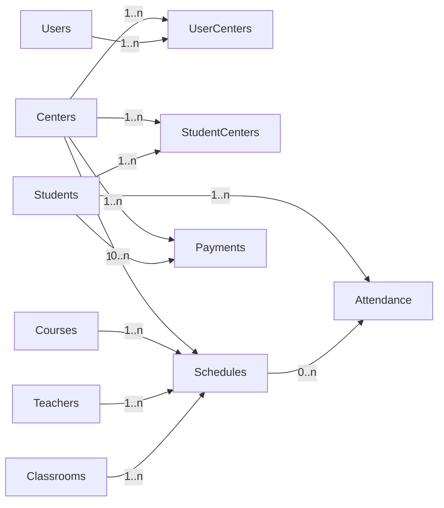

## App architecture (high level)

```mermaid
flowchart TD
  entry[main.dart] --> initSupabase[SupabaseClientManager.initialize]
  entry --> initDrift[AppDatabase]
  initDrift --> localRepo[DatabaseRepository]
  initSupabase --> cloudRepo[SupabaseRepository]
  entry --> authBloc[AuthBloc]
  authBloc --> router[AppRouter (GoRouter)]
  router --> shell[AppShell/Sidebar]
  shell --> features[Feature Screens]
```

## Data/DB relationships (simplified)



## Setup notes

- Supply Supabase credentials via `--dart-define-from-file=supabase.env`.
- Local Drift schema lives in `lib/core/database/tables.dart`; Supabase schema is defined in `full_schema.sql`.
- Auth routing now listens to live Supabase auth changes via `_AuthRefreshNotifier`.

